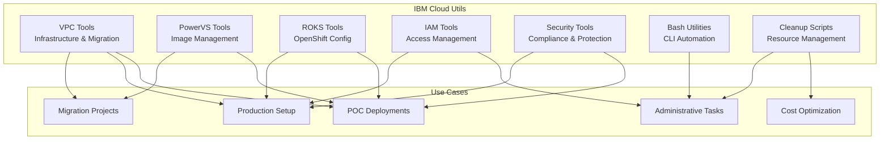
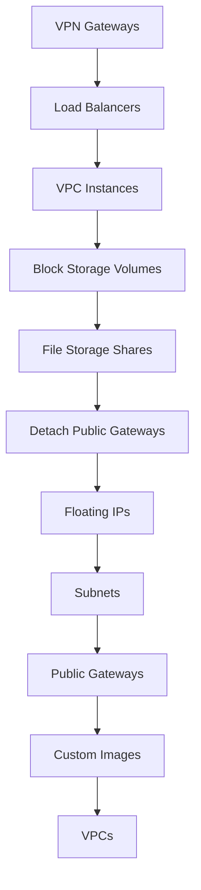

# IBM Cloud Utils

[](https://www.terraform.io/)
[](https://cloud.ibm.com/)
[](https://www.gnu.org/software/bash/)

A comprehensive collection of IBM Cloud utilities, automation scripts, and infrastructure templates for streamlining cloud operations, POC deployments, and administrative tasks.

## 📑 Table of Contents

- [Overview](#-overview)
- [Architecture & Use Cases](#-architecture--use-cases)
- [Prerequisites](#-prerequisites)
- [Repository Structure](#-repository-structure)
- [Tool Categories](#-tool-categories)
  - [VPC Tools](#vpc-tools)
  - [PowerVS Tools](#powervs-tools)
  - [ROKS Tools](#roks-tools)
  - [IAM Tools](#iam-tools)
  - [Security & Compliance Tools](#security--compliance-tools)
  - [Bash Utilities](#bash-utilities)
  - [Cleanup Scripts](#cleanup-scripts)
- [Quick Start](#-quick-start)
- [Common Workflows](#-common-workflows)
- [Configuration](#-configuration)
- [Best Practices](#-best-practices)
- [Troubleshooting](#-troubleshooting)
- [Additional Resources](#-additional-resources)

## 🎯 Overview

This repository provides a curated set of tools designed to simplify IBM Cloud operations across multiple service domains. Whether you're building proof-of-concept environments, managing production infrastructure, or performing administrative tasks, these utilities help automate common workflows and reduce manual effort.

### Key Features

- **Multi-Service Coverage**: Tools for VPC, PowerVS, ROKS, IAM, and more
- **Infrastructure as Code**: Terraform modules for repeatable deployments
- **Automation Scripts**: Bash utilities for quick operations
- **Safety First**: Cleanup scripts with built-in safeguards
- **POC-Ready**: Templates optimized for rapid environment setup
- **Production-Capable**: Scalable configurations for enterprise use

## 🏗️ Architecture & Use Cases

This repository supports various IBM Cloud workflows:



### Typical Use Cases

- **POC Environments**: Rapidly deploy infrastructure for client demonstrations
- **Production Deployments**: Scalable, repeatable infrastructure provisioning
- **Migration Projects**: Tools for VMware-to-VPC sizing and PowerVS image management
- **Administrative Tasks**: User management, access control, and resource cleanup
- **Cost Optimization**: Safe teardown of unused resources after engagements
- **Security & Compliance**: Automated security posture management and workload protection

## 📋 Prerequisites

### Required Tools

- **IBM Cloud CLI** >= 2.0 ([Install](https://cloud.ibm.com/docs/cli))
- **Terraform** >= 1.5.0 ([Download](https://www.terraform.io/downloads))
- **Bash** >= 4.0 (macOS/Linux) or Git Bash (Windows)
- **jq** >= 1.6 ([Install](https://stedolan.github.io/jq/download/))

### Optional Tools

- **Python** >= 3.8 (for VMware migration tools)
- **kubectl** (for ROKS utilities)
- **Git** (for version control)

### IBM Cloud Requirements

- **IBM Cloud Account** ([Sign up](https://cloud.ibm.com/registration))
- **IBM Cloud API Key** ([Create one](https://cloud.ibm.com/iam/apikeys))
- **Appropriate IAM Permissions**:
  - VPC Infrastructure Services (Editor or Administrator)
  - Resource Group access (Viewer minimum)
  - IAM Access Groups (Administrator for IAM tools)
  - Power Systems Virtual Server (Editor for PowerVS tools)

### IBM Cloud CLI Plugins

Install required plugins:

```bash
# VPC Infrastructure
ibmcloud plugin install vpc-infrastructure

# Power Systems
ibmcloud plugin install power-iaas

# Schematics (for Terraform)
ibmcloud plugin install schematics

# Container Service (for ROKS)
ibmcloud plugin install container-service
```

## 📁 Repository Structure

```
ibm-cloud-utils/
├── vpc/                      # VPC infrastructure tools
│   ├── vpc-tf/              # Terraform VPC deployment
│   └── vmware-to-vpc-profiles/  # VMware migration sizing tool
├── powervs/                  # Power Virtual Server tools
│   └── bluexport-tf/        # Image capture and export automation
├── roks/                     # Red Hat OpenShift tools
│   └── storage/             # Storage configuration templates
├── iam/                      # Identity and Access Management
│   ├── add-users/           # User invitation automation
│   ├── create-admin-access-group/  # Admin access group setup
│   └── create-admin-resource-group/  # Resource group creation
├── sccwp/                    # Security & Compliance tools
│   └── sccwp-poc/           # SCC Workload Protection POC
├── bash/                     # Bash utility scripts
│   ├── delete-instance-ip/  # VSI deletion by IP
│   └── ping-latency-mrz-madrid/  # Network latency testing
└── cleanup-scripts/          # Resource cleanup utilities
    ├── cleanup_ibmcloud_vpc.sh       # VPC resource cleanup
    ├── cleanup_ibmcloud_cos.sh       # Cloud Object Storage cleanup
    └── cleanup_ibmcloud_schematics.sh  # Schematics workspace cleanup
```

## 🛠️ Tool Categories

### VPC Tools

**Location**: `vpc/`

Tools for IBM Cloud Virtual Private Cloud infrastructure automation and management.

#### Available Tools

| Tool | Description | Technology |
|------|-------------|------------|
| **vpc-tf** | Production-ready VPC deployment with multi-zone high availability | Terraform |
| **vmware-to-vpc-profiles** | Web application for VMware-to-VPC instance sizing and cost estimation | Python/Flask |

#### Key Features

- **Multi-Zone VPC Deployment**: Automated creation of VPC with subnets across 3 availability zones
- **Network Configuration**: Public gateways, security groups, and network ACLs
- **Migration Planning**: Analyze VMware RVTools exports and recommend IBM Cloud VPC profiles
- **Cost Estimation**: Calculate monthly costs for migrated workloads

#### Quick Example

```bash
# Deploy a production VPC
cd vpc/vpc-tf
terraform init
terraform apply -var-file="terraform.tfvars"

# Run VMware sizing tool
cd vpc/vmware-to-vpc-profiles
python vmware-app-no-key.py
# Access at http://localhost:5000
```

#### Use Cases

- Rapid VPC infrastructure deployment for POCs
- Multi-zone production environments
- VMware to IBM Cloud migration planning
- Network architecture validation

---

### PowerVS Tools

**Location**: `powervs/`

Automation tools for IBM Power Systems Virtual Server operations.

#### Available Tools

| Tool | Description | Technology |
|------|-------------|------------|
| **bluexport-tf** | Capture PowerVS instances and export to Cloud Object Storage or Image Catalog | Terraform |

#### Key Features

- **Automated Image Capture**: Snapshot running PowerVS instances
- **Flexible Export**: Export to COS buckets or Image Catalog
- **Timestamped Naming**: Automatic unique naming with timestamps
- **Disaster Recovery**: Create backups for DR scenarios

#### Quick Example

```bash
cd powervs/bluexport-tf/export-catalog
terraform init
terraform apply -var-file="var.tfvars.json"
```

#### Configuration

Create `var.tfvars.json`:

```json
{
  "ibmcloud_api_key": "your-api-key",
  "pws_id": "your-powervs-workspace-id",
  "pvs_name": "instance-name",
  "destination": "image-catalog"
}
```

#### Use Cases

- PowerVS instance backup and recovery
- Image catalog management
- Cross-region image distribution
- Migration preparation

---

### ROKS Tools

**Location**: `roks/`

Configuration templates and utilities for Red Hat OpenShift on IBM Cloud.

#### Available Tools

| Tool | Description | Technology |
|------|-------------|------------|
| **storage/** | Persistent Volume Claim (PVC) templates for block and file storage | YAML |

#### Key Features

- **Dynamic Provisioning**: PVC templates with StorageClass integration
- **Multiple Storage Types**: Block storage and file storage configurations
- **Production-Ready**: Configurable access modes and storage sizes
- **Best Practices**: Documented configuration options and usage notes

#### Quick Example

```bash
# Deploy block storage PVC
cd roks/storage
oc apply -f block-storage-pvc.yaml

# Verify PVC creation
oc get pvc
oc describe pvc my-block-storage-pvc
```

#### Storage Options

**Block Storage** (`block-storage-pvc.yaml`):
- Access Modes: `ReadWriteOnce`, `ReadWriteOncePod`
- Use Cases: Databases, single-pod applications
- Performance: High IOPS for demanding workloads

**File Storage** (`file-storage-pvc.yaml`):
- Access Modes: `ReadWriteMany`, `ReadOnlyMany`
- Use Cases: Shared storage, multi-pod applications
- Performance: NFS-based shared file systems

#### Use Cases

- Persistent storage for OpenShift applications
- Database storage configuration
- Shared file systems for multi-pod deployments
- Storage class testing and validation

---

### IAM Tools

**Location**: `iam/`

Terraform modules for automating IBM Cloud Identity and Access Management.

#### Available Tools

| Tool | Description | Technology |
|------|-------------|------------|
| **add-users** | Invite users and assign to access groups | Terraform |
| **create-admin-access-group** | Create access group with full administrator privileges | Terraform |
| **create-admin-resource-group** | Create and configure resource groups | Terraform |

#### Key Features

- **Automated User Onboarding**: Invite users and assign permissions in one step
- **Policy Templates**: Pre-configured admin policies for common scenarios
- **Resource Group Management**: Automated resource group creation
- **Access Group Automation**: Consistent permission assignment

#### Quick Example

```bash
# Create admin access group
cd iam/create-admin-access-group
terraform init
terraform apply -var-file="var.tfvars.json"

# Invite users to access group
cd ../add-users
terraform apply -var="ag=admin_ag"
```

#### Admin Access Group Policies

The admin access group includes:
- **All IAM Services**: Administrator and Manager roles
- **Account Management**: Full administrator access
- **Resource Groups**: Viewer, Reader, and Editor roles
- **Support Center**: Editor role
- **Security & Compliance**: Administrator and Editor roles
- **IAM Identity**: API key and Service ID creation

#### Use Cases

- Rapid user onboarding for new projects
- Consistent permission management
- POC environment setup
- Team access provisioning

---

### Security & Compliance Tools

**Location**: `sccwp/`

Tools for IBM Cloud Security and Compliance Center Workload Protection.

#### Available Tools

| Tool | Description | Technology |
|------|-------------|------------|
| **sccwp-poc** | Complete POC environment with SCC Workload Protection | Terraform |

#### Key Features

- **Complete POC Setup**: VPC, VSIs (Linux/Windows), and SCC WP instance
- **Security Configuration**: Pre-configured security groups and network ACLs
- **Multi-OS Support**: Linux and Windows test instances
- **Ansible Integration**: Playbooks for agent deployment

#### Architecture

The POC creates:
- VPC with custom address prefix and subnet
- Linux VSI (Ubuntu) with floating IP
- Windows VSI (Windows Server) with floating IP
- Security groups (SSH, RDP, outbound)
- SCC Workload Protection instance

#### Quick Example

```bash
cd sccwp/sccwp-poc/infra
terraform init
terraform apply -var-file="my.tfvars.json"
```

#### Use Cases

- Security and compliance POC demonstrations
- Workload protection testing
- Security posture validation
- Compliance automation evaluation

---

### Bash Utilities

**Location**: `bash/`

Command-line utilities for common IBM Cloud operations.

#### Available Tools

| Tool | Description | Use Case |
|------|-------------|----------|
| **delete-instance-ip** | Delete VPC instance by IP address | Quick instance cleanup |
| **ping-latency-mrz-madrid** | Network latency testing between regions | Performance validation |

#### Key Features

- **Quick Operations**: Fast execution without Terraform overhead
- **Error Handling**: Built-in validation and error messages
- **Logging**: Automated logging for network tests
- **Safety Checks**: Confirmation prompts for destructive operations

#### Quick Examples

```bash
# Delete instance by IP
cd bash/delete-instance-ip
./delete_instance_ip.sh 10.10.10.5

# Run latency tests
cd bash/ping-latency-mrz-madrid
./ping_test.sh
# Results saved to lisboa.log
```

#### Use Cases

- Quick instance cleanup during testing
- Network performance validation
- Latency testing between regions
- Troubleshooting connectivity issues

---

### Cleanup Scripts

**Location**: `cleanup-scripts/`

Safe resource cleanup utilities for cost management and environment teardown.

#### Available Scripts

| Script | Description | Resources Cleaned |
|--------|-------------|-------------------|
| **cleanup_ibmcloud_vpc.sh** | Complete VPC infrastructure cleanup | VPCs, subnets, instances, volumes, gateways, floating IPs |
| **cleanup_ibmcloud_cos.sh** | Cloud Object Storage cleanup | COS service instances and buckets |
| **cleanup_ibmcloud_schematics.sh** | Schematics workspace cleanup | Terraform workspaces |

#### Key Features

- **Dependency-Aware**: Deletes resources in correct order
- **Wait Mechanisms**: Ensures resources are fully deleted before proceeding
- **Progress Indicators**: Visual feedback during cleanup
- **Verification**: Final check for remaining resources
- **Safety**: Force flags prevent accidental execution

#### VPC Cleanup Order



#### Quick Examples

```bash
# Clean up all VPC resources
cd cleanup-scripts
./cleanup_ibmcloud_vpc.sh

# Clean up Cloud Object Storage
./cleanup_ibmcloud_cos.sh

# Clean up Schematics workspaces
./cleanup_ibmcloud_schematics.sh
```

#### Safety Features

- **Confirmation Required**: Scripts use `-f` flag for force deletion
- **Resource Validation**: Checks if resources exist before deletion
- **Wait Loops**: Ensures complete deletion before proceeding
- **Status Messages**: Clear feedback on deletion progress
- **Final Verification**: Lists remaining resources after cleanup

#### Use Cases

- Post-POC environment cleanup
- Cost reduction after testing
- Account hygiene and maintenance
- Preparing accounts for new projects

---

## 🚀 Quick Start

### 1. Clone the Repository

```bash
git clone <repository-url>
cd ibm-cloud-utils
```

### 2. Set Up IBM Cloud CLI

```bash
# Install IBM Cloud CLI
curl -fsSL https://clis.cloud.ibm.com/install/linux | sh

# Login to IBM Cloud
ibmcloud login --apikey YOUR_API_KEY -r us-south

# Install required plugins
ibmcloud plugin install vpc-infrastructure
ibmcloud plugin install power-iaas
```

### 3. Configure API Key

```bash
# Set environment variable (recommended)
export IBMCLOUD_API_KEY="your-api-key-here"

# Or create terraform.tfvars for Terraform tools
echo 'ibmcloud_api_key = "your-api-key-here"' > terraform.tfvars
```

### 4. Choose Your Tool

Navigate to the appropriate directory and follow the tool-specific README or instructions.

## 🔄 Common Workflows

### Workflow 1: Deploy POC Environment

```bash
# 1. Create VPC infrastructure
cd vpc/vpc-tf
terraform init && terraform apply

# 2. Set up IAM access
cd ../../iam/create-admin-access-group
terraform init && terraform apply

# 3. Deploy ROKS storage
cd ../../roks/storage
oc apply -f block-storage-pvc.yaml
```

### Workflow 2: Migration Planning

```bash
# 1. Analyze VMware environment
cd vpc/vmware-to-vpc-profiles
python vmware-app-no-key.py
# Upload RVTools export at http://localhost:5000

# 2. Review recommendations and costs
# 3. Deploy VPC infrastructure
cd ../vpc-tf
terraform apply
```

### Workflow 3: Environment Cleanup

```bash
# 1. Clean up VPC resources
cd cleanup-scripts
./cleanup_ibmcloud_vpc.sh

# 2. Clean up COS instances
./cleanup_ibmcloud_cos.sh

# 3. Clean up Schematics workspaces
./cleanup_ibmcloud_schematics.sh
```

## ⚙️ Configuration

### Environment Variables

```bash
# IBM Cloud API Key (required for most tools)
export IBMCLOUD_API_KEY="your-api-key"

# Default region (optional)
export IBMCLOUD_REGION="us-south"

# Terraform log level (optional)
export TF_LOG="INFO"
```

### Terraform Variables

Most Terraform modules accept these common variables:

```hcl
# terraform.tfvars
ibmcloud_api_key = "your-api-key"
region           = "us-south"
resource_group   = "default"
prefix           = "my-project"
tags             = ["terraform", "poc"]
```

### IBM Cloud CLI Configuration

```bash
# Set default region
ibmcloud target -r us-south

# Set default resource group
ibmcloud target -g default

# Verify configuration
ibmcloud target
```

## 💡 Best Practices

### Security

- **Never commit API keys**: Use environment variables or `.tfvars` files (add to `.gitignore`)
- **Use least privilege**: Assign minimum required IAM permissions
- **Rotate credentials**: Regularly rotate API keys and service IDs
- **Enable MFA**: Use multi-factor authentication for IBM Cloud accounts

### Cost Management

- **Tag resources**: Use consistent tagging for cost tracking
- **Clean up regularly**: Use cleanup scripts after POCs
- **Monitor usage**: Set up billing alerts in IBM Cloud
- **Right-size instances**: Use VMware sizing tool for accurate capacity planning

### Infrastructure as Code

- **Version control**: Track all Terraform configurations in Git
- **State management**: Use remote state for team collaboration
- **Module versioning**: Pin module versions for stability
- **Plan before apply**: Always review `terraform plan` output

### Operational

- **Document changes**: Maintain clear commit messages
- **Test in dev first**: Validate changes in non-production environments
- **Backup critical data**: Use PowerVS export tools for backups
- **Monitor deployments**: Check IBM Cloud console after automation runs

## 🔍 Troubleshooting

### Common Issues

#### Authentication Errors

**Error**: `Error: The provided API key is invalid`

**Solution**:
```bash
# Verify API key
ibmcloud iam api-keys

# Create new API key if needed
ibmcloud iam api-key-create my-api-key -d "Description"

# Update environment variable
export IBMCLOUD_API_KEY="new-api-key"
```

#### Terraform State Lock

**Error**: `Error: Error acquiring the state lock`

**Solution**:
```bash
# Force unlock (use with caution)
terraform force-unlock <lock-id>

# Or remove local state lock file
rm -f .terraform.tfstate.lock.info
```

#### Resource Quota Exceeded

**Error**: `Quota exceeded for resource type 'vpc'`

**Solution**:
1. Check current quotas: IBM Cloud Console → Manage → Account → Account settings
2. Delete unused resources using cleanup scripts
3. Request quota increase through IBM Cloud support

#### VPC Cleanup Failures

**Error**: Resources not deleting in correct order

**Solution**:
```bash
# Run cleanup script multiple times
./cleanup_ibmcloud_vpc.sh

# Manually check for stuck resources
ibmcloud is instances
ibmcloud is vpcs

# Force delete specific resources
ibmcloud is instance-delete <instance-id> --force
```

#### Module Download Failures

**Error**: `Error downloading modules`

**Solution**:
```bash
# Clear Terraform cache
rm -rf .terraform .terraform.lock.hcl

# Re-initialize
terraform init -upgrade
```

### Getting Help

1. **Check IBM Cloud Status**: https://cloud.ibm.com/status
2. **IBM Cloud Documentation**: https://cloud.ibm.com/docs
3. **IBM Cloud Support**: https://cloud.ibm.com/unifiedsupport/supportcenter
4. **Terraform IBM Provider Issues**: https://github.com/IBM-Cloud/terraform-provider-ibm/issues

### Debug Mode

Enable verbose logging:

```bash
# Terraform debug
export TF_LOG=DEBUG
terraform apply

# IBM Cloud CLI debug
ibmcloud -v <command>

# Bash script debug
bash -x script.sh
```

## 📚 Additional Resources

### Documentation

- [IBM Cloud Documentation](https://cloud.ibm.com/docs)
- [IBM Cloud VPC](https://cloud.ibm.com/docs/vpc)
- [IBM Power Systems Virtual Server](https://cloud.ibm.com/docs/power-iaas)
- [Red Hat OpenShift on IBM Cloud](https://cloud.ibm.com/docs/openshift)
- [IBM Cloud IAM](https://cloud.ibm.com/docs/account?topic=account-iamoverview)
- [Terraform IBM Provider](https://registry.terraform.io/providers/IBM-Cloud/ibm/latest/docs)

### Tutorials

- [Getting Started with IBM Cloud](https://cloud.ibm.com/docs/overview?topic=overview-whatis-platform)
- [VPC Networking Concepts](https://cloud.ibm.com/docs/vpc?topic=vpc-about-networking-for-vpc)
- [Terraform on IBM Cloud](https://cloud.ibm.com/docs/ibm-cloud-provider-for-terraform)
- [OpenShift Storage Configuration](https://docs.openshift.com/container-platform/latest/storage/understanding-persistent-storage.html)

### Best Practices Guides

- [IBM Cloud Architecture Center](https://www.ibm.com/cloud/architecture/architectures)
- [VPC Security Best Practices](https://cloud.ibm.com/docs/vpc?topic=vpc-security-in-your-vpc)
- [High Availability on IBM Cloud](https://cloud.ibm.com/docs/overview?topic=overview-ha-regions)
- [Cost Optimization Strategies](https://cloud.ibm.com/docs/billing-usage?topic=billing-usage-cost)

### Community

- [IBM Cloud Community](https://community.ibm.com/community/user/cloud/home)
- [IBM Developer](https://developer.ibm.com/)
- [Terraform Community](https://discuss.hashicorp.com/c/terraform-core)

---

**⚠️ Important Notice**: These utilities are provided for demonstration, testing, and enablement purposes. Always review and adapt configurations to your specific requirements before deploying in production environments. Test thoroughly in non-production environments first.

**📝 Contributing**: This repository is actively maintained and expanded. Tools and utilities are added based on common use cases and client requirements.

**🔒 Security**: Never commit sensitive information (API keys, passwords, etc.) to version control. Use environment variables, secret management tools, or `.tfvars` files that are excluded from Git.