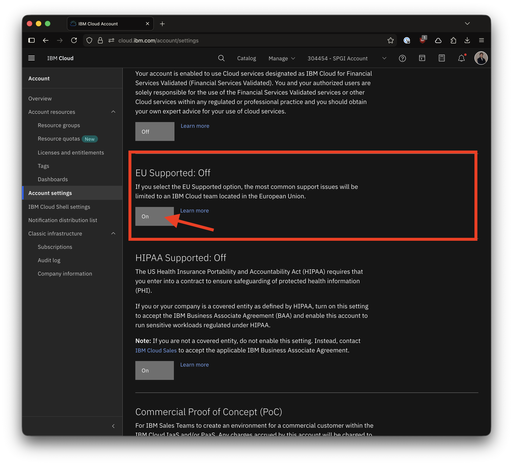
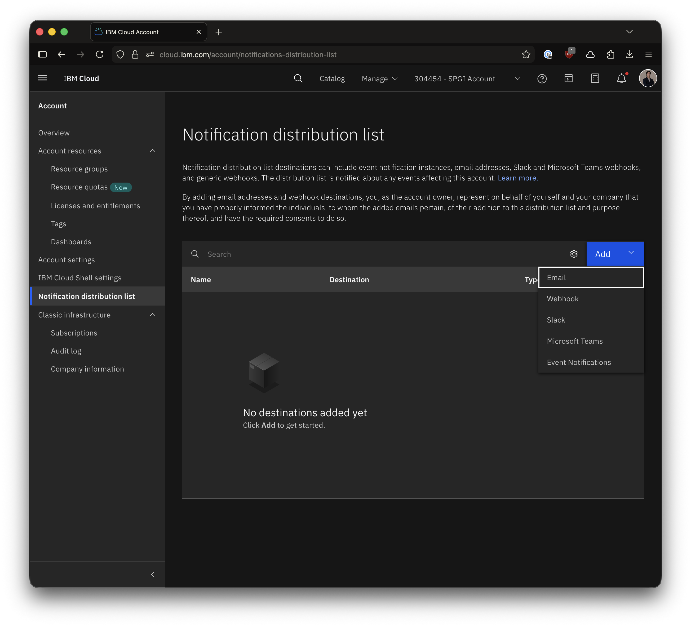
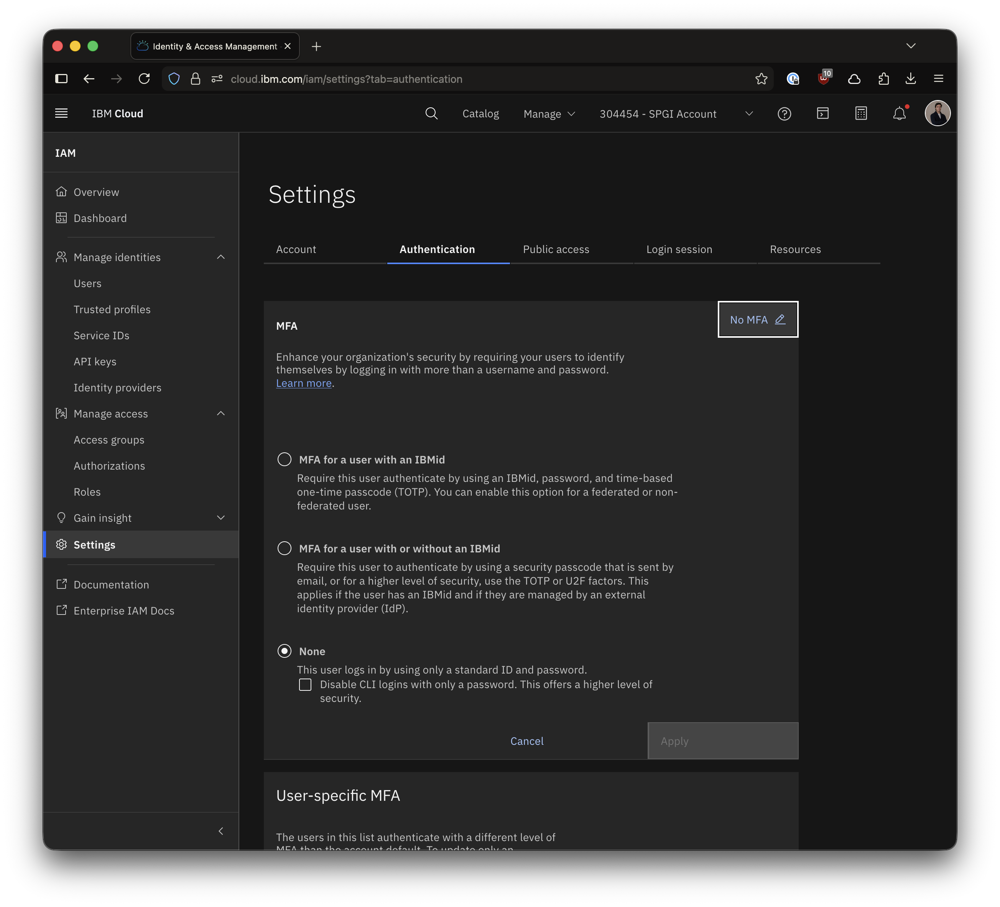
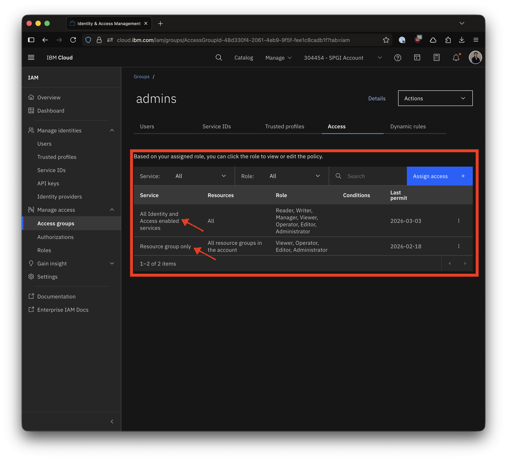
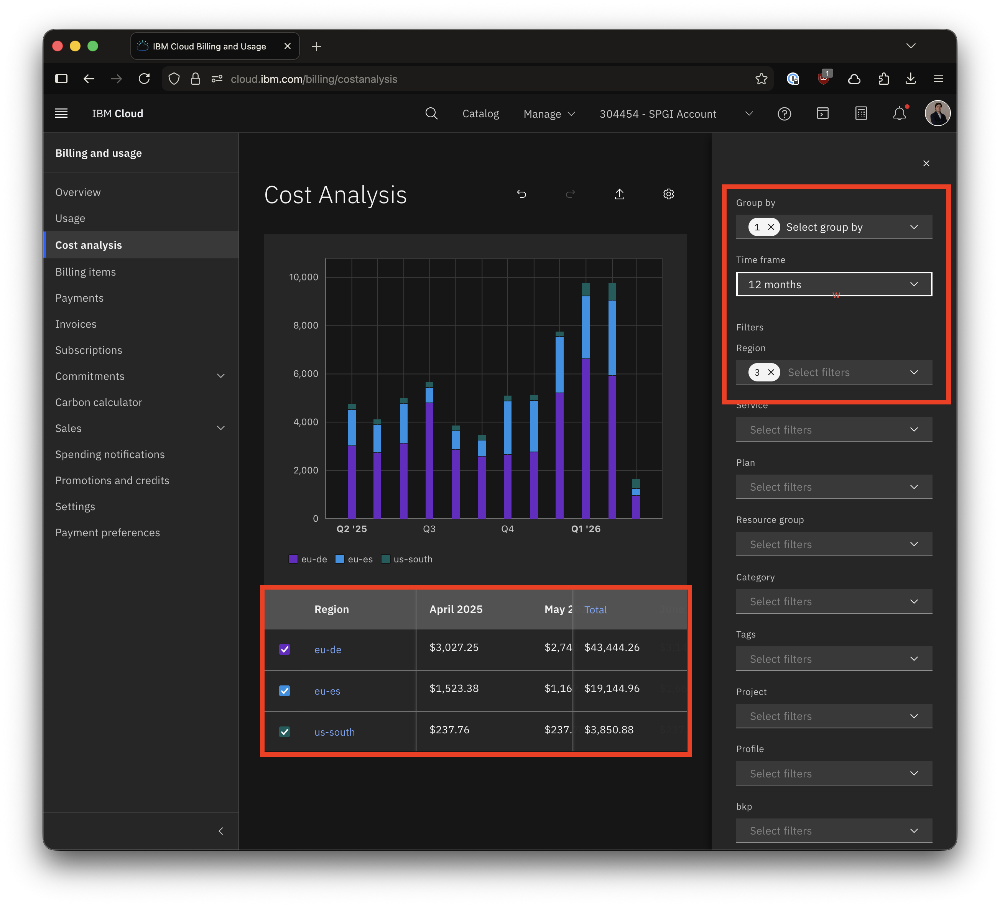
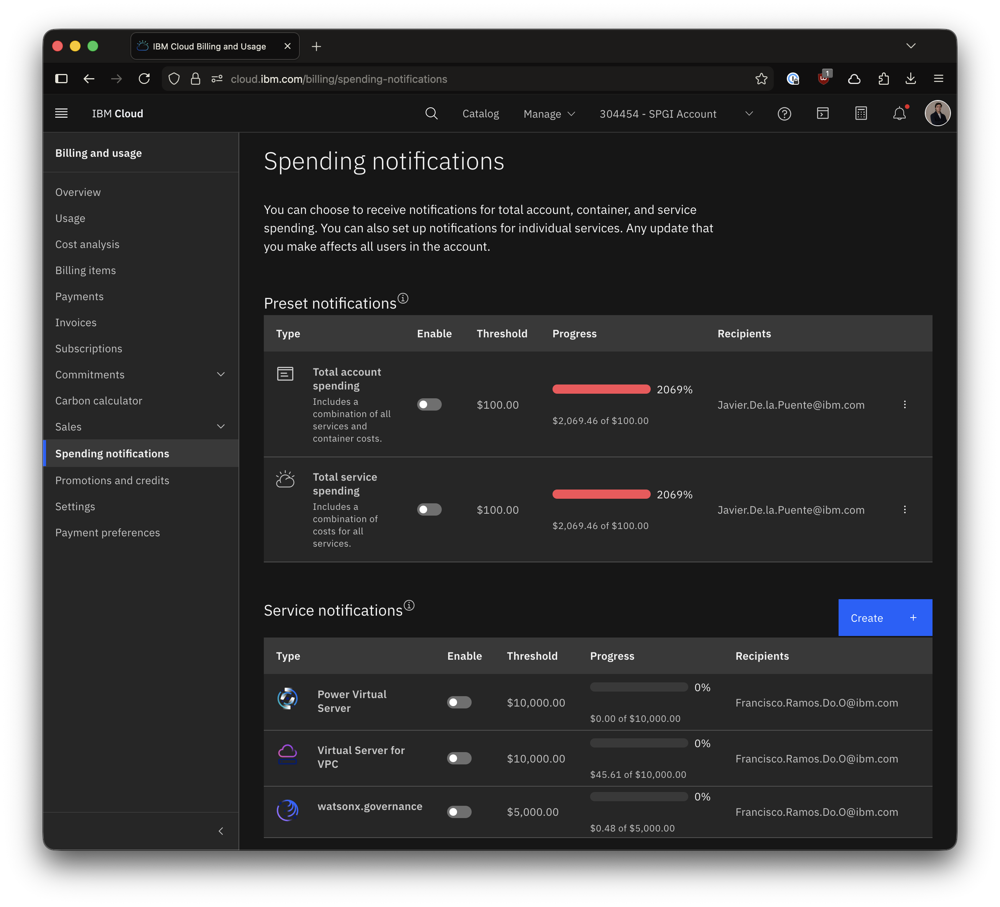

# Guião Boas Práticas de Configuração de Conta

Este documento fornece orientações sobre as tarefas iniciais de configuração de uma conta **IBM Cloud**, focado em segurança, gestão de identidade e controlo de custos.

## Índice

1. [Configuração Inicial da Conta](#1-configuração-inicial-da-conta)
2. [IAM - Identity and Access Management](#2-iam---identity-and-access-management)
3. [Billing and Usage - Monitorização de Custos](#3-billing-and-usage---monitorização-de-custos)
4. [Ambientes DEV e PROD](#4-ambientes-dev-e-prod)
5. [Checklist de Segurança](#5-checklist-de-segurança)


## 1. Configuração Inicial da Conta

### 1.1 EU Support (Suporte Europeu)

**O que é:** A IBM Cloud oferece suporte específico para clientes na União Europeia, garantindo conformidade com GDPR e outras regulamentações europeias.

**Configuração:**
- **Região de Dados:** Escolha regiões europeias (Frankfurt, Londres, Madrid) para armazenar dados
- **EU Supported:** Ative a flag "EU Supported" nas configurações da conta
  - Aceda a: `Manage` → `Account` → `Account settings`
  - Ative: `EU Supported` (garante que apenas equipas de suporte na UE acedem aos seus dados)
- **Data Residency:** Configure políticas de residência de dados para garantir que os dados não saem da UE

**Porquê é importante:**
- Conformidade com GDPR
- Proteção de dados sensíveis
- Requisitos legais e contratuais


*Figura: Ativação da opção "EU Supported" nas configurações da conta IBM Cloud*


### 1.2 Account Notifications (Notificações da Conta)

**O que é:** Sistema de alertas para eventos importantes na conta (manutenções, incidentes, atualizações de segurança).

**Configuração:**
1. Aceda a: `Manage` → `Account` → `Notification preferences`
2. Configure [notificações](https://cloud.ibm.com/account/notifications-distribution-list) para:
   - **Planned Maintenance:** Manutenções programadas
   - **Unplanned Incidents:** Incidentes não planeados
   - **Security Bulletins:** Boletins de segurança
   - **Account Events:** Eventos da conta (alterações de configuração)

**Boas Práticas:**
- Configure múltiplos contactos (não dependa de uma única pessoa)
- Use listas de distribuição de email
- Integre com ferramentas de gestão de incidentes (PagerDuty, ServiceNow)


*Figura: Configurações de notificações da conta IBM Cloud*

### 1.3 Security - Segurança da Conta

#### 1.3.1 Two-Factor Authentication (2FA)

**O que é:** Camada adicional de segurança que requer dois métodos de verificação para aceder à conta.

**Configuração Obrigatória:**
1. Aceda a: `Manage` → `Access (IAM)` → `Settings`
2. Ative: `MFA for all users (IBMid)` ou `MFA for non-federated users`
3. Tipos de MFA disponíveis:
   - **TOTP (Time-based One-Time Password):** Apps como Google Authenticator, Microsoft Authenticator
   - **U2F (Universal 2nd Factor):** Chaves de segurança físicas (YubiKey)
   - **SMS:** Menos seguro, não recomendado para produção

**Níveis de MFA:**
- **TOTP:** Recomendado para todos os utilizadores
- **TOTP4ALL:** MFA obrigatório para todos, incluindo utilizadores federados
- **LEVEL1/2/3:** Níveis crescentes de segurança (LEVEL3 é o mais restritivo)


*Figura: Configurações de MFA*

**CRÍTICO:** Ative MFA ANTES de convidar utilizadores para a conta!

#### 1.3.2 Single Sign-On (SSO)

**O que é:** Permite que utilizadores acedam à IBM Cloud usando as credenciais corporativas da empresa (Active Directory, Okta, Azure AD).

**Configuração:**
1. Configure um **Identity Provider (IdP)** compatível com SAML 2.0
2. Na IBM Cloud: `Manage` → `Access (IAM)` → `Identity providers`
3. Configure o IdP:
   - Upload do metadata XML do IdP
   - Configure atributos SAML (email, nome, grupos)
   - Teste a integração

**Benefícios:**
- Gestão centralizada de utilizadores
- Desativação automática quando utilizador sai da empresa
- Políticas de password corporativas aplicadas
- Melhor experiência de utilizador (um único login)

**Boas Práticas:**
- Use SSO em conjunto com MFA no IdP
- Configure grupos do IdP para mapear para Access Groups na IBM Cloud
- Teste o processo de login antes de migrar todos os utilizadores

#### 1.3.3 Outras Configurações de Segurança

**IP Allowlisting:**
- Configure IPs permitidos para acesso à conta
- Útil para restringir acesso apenas a redes corporativas
- Configuração: `Manage` → `Access (IAM)` → `Settings` → `IP address restrictions`

**Session Timeout:**
- Configure timeout de sessão (recomendado: 2-4 horas)
- Força re-autenticação após período de inatividade

**API Key Restrictions:**
- Limite a criação de API keys apenas a administradores
- Configure expiração automática de API keys

## 2. IAM - Identity and Access Management

### 2.1 Conceitos Fundamentais

**O que é IAM:** Sistema de gestão de identidades e permissões que controla quem pode aceder a quê na IBM Cloud.

**Componentes principais:**
- **Users (Utilizadores):** Pessoas que acedem à conta
- **Service IDs:** Identidades para aplicações e serviços
- **Access Groups:** Grupos de utilizadores com permissões comuns
- **Policies:** Regras que definem permissões
- **Roles:** Conjuntos de ações permitidas

### 2.2 Estrutura de Utilizadores

#### 2.2.1 Tipos de Utilizadores

**Account Owner (Proprietário da Conta):**
- Controlo total sobre a conta
- Único que pode eliminar a conta
- Deve ser protegido com MFA forte

**Administrators:**
- Gestão de utilizadores e permissões
- Configuração de políticas de segurança
- Acesso a billing

**Developers:**
- Criação e gestão de recursos
- Deploy de aplicações
- Acesso limitado a configurações de conta

**Viewers/Auditors:**
- Apenas leitura
- Útil para auditoria e compliance

#### 2.2.2 Convidar Utilizadores

**Processo:**
1. Aceda a: `Manage` → `Access (IAM)` → `Users`
2. Clique em `Invite users`
3. Insira emails dos utilizadores
4. Atribua a Access Groups (recomendado) ou políticas individuais
5. Envie convite

**Boas Práticas:**
- Use Access Groups em vez de políticas individuais
- Atribua apenas as permissões mínimas necessárias (Principle of Least Privilege)
- Documente o motivo de cada permissão atribuída
- Reveja permissões regularmente (trimestral)

### 2.3 Access Groups (Grupos de Acesso)

**O que são:** Grupos que agregam utilizadores e Service IDs com permissões comuns.

**Estrutura Recomendada:**

```
├── Administrators
│   ├── Account Management (todas as permissões)
│   └── All Resources (Administrator role)
│
├── Developers-DEV
│   ├── Resource Group: DEV (Editor role)
│   └── Specific Services (Editor role)
│
├── Developers-PROD
│   ├── Resource Group: PROD (Operator role)
│   └── Specific Services (Operator role)
│
├── Viewers
│   ├── All Resources (Viewer role)
│   └── Billing (Viewer role)
│
└── Billing-Managers
    └── Billing (Administrator role)
```

**Criação de Access Group:**
1. Aceda a: `Manage` → `Access (IAM)` → `Access groups`
2. Clique em `Create`
3. Nome: Use convenção clara (ex: `AG-Developers-DEV`)
4. Descrição: Documente o propósito do grupo
5. Adicione utilizadores
6. Atribua políticas de acesso

### 2.4 Policies (Políticas de Acesso)

**O que são:** Regras que definem quem pode fazer o quê em quais recursos.

**Componentes de uma Policy:**
- **Subject:** Quem (utilizador, Service ID, Access Group)
- **Target:** O quê (serviço, recurso, resource group)
- **Role:** Que ações (Viewer, Operator, Editor, Administrator)

**Tipos de Roles:**

**Platform Roles (Gestão de recursos):**
- **Viewer:** Ver recursos, não pode modificar
- **Operator:** Ver e executar ações (ex: reiniciar VM)
- **Editor:** Criar, modificar, eliminar recursos
- **Administrator:** Todas as ações + gerir permissões

**Service Roles (Acesso a serviços):**
- **Reader:** Ler dados do serviço
- **Writer:** Ler e escrever dados
- **Manager:** Todas as operações do serviço

**Exemplo de Policy:**
```
Subject: Access Group "Developers-DEV"
Target: Resource Group "DEV" + Service "VPC Infrastructure"
Roles: Platform Editor + Service Manager
```


*Figura: Acessos "Admin" Resource Group*

**Boas Práticas:**
- Use Resource Groups para organizar recursos por ambiente (DEV, PROD)
- Atribua políticas a Access Groups, não a utilizadores individuais
- Use tags para controlo de acesso granular
- Documente todas as políticas criadas

### 2.5 Service IDs e API Keys

#### 2.5.1 Service IDs

**O que são:** Identidades para aplicações, serviços e automação (não são utilizadores humanos).

**Quando usar:**
- Aplicações que acedem a IBM Cloud
- Scripts de automação
- CI/CD pipelines
- Integrações entre serviços

**Criação:**
1. Aceda a: `Manage` → `Access (IAM)` → `Service IDs`
2. Clique em `Create`
3. Nome: Use convenção (ex: `SID-App-Production`)
4. Descrição: Documente o propósito
5. Atribua políticas de acesso
6. Crie API Key para o Service ID

#### 2.5.2 API Keys

**O que são:** Credenciais para acesso programático à IBM Cloud.

**Tipos:**
- **User API Keys:** Associadas a um utilizador
- **Service ID API Keys:** Associadas a um Service ID (recomendado para automação)

**Criação de API Key:**
1. Para User: `Manage` → `Access (IAM)` → `API keys`
2. Para Service ID: `Manage` → `Access (IAM)` → `Service IDs` → Selecione Service ID → `API keys`
3. Clique em `Create`
4. Nome descritivo
5. **IMPORTANTE:** Copie a API key imediatamente (não pode ser recuperada depois)

**Boas Práticas de Segurança:**
- **NUNCA** commite API keys em código (use secrets managers)
- Use Service IDs em vez de User API keys para automação
- Rotacione API keys regularmente (recomendado: 90 dias)
- Configure expiração automática
- Use diferentes API keys para diferentes ambientes (DEV, PROD)
- Armazene em: IBM Secrets Manager, HashiCorp Vault, ou similar
- Limite permissões ao mínimo necessário
- Monitore uso de API keys (logs de auditoria)

**Rotação de API Keys:**
1. Crie nova API key
2. Atualize aplicações para usar nova key
3. Teste em DEV primeiro
4. Deploy em PROD
5. Elimine API key antiga após confirmação

## 3. Billing and Usage - Monitorização de Custos

### 3.1 Conceitos de Billing

**O que é:** Sistema de faturação e monitorização de custos da IBM Cloud.

**Tipos de Conta:**
- **Lite:** Gratuita, recursos limitados
- **Pay-As-You-Go:** Paga pelo que usa, sem compromisso
- **Subscription:** Compromisso mensal/anual com descontos

### 3.2 Resource Groups

**O que são:** Contentores lógicos para organizar recursos e controlar custos.

**Estrutura Recomendada:**
```
├── RG-DEV (Desenvolvimento)
├── RG-TEST (Testes)
├── RG-STAGING (Pré-produção)
└── RG-PROD (Produção)
```

**Criação:**
1. Aceda a: `Manage` → `Account` → `Resource groups`
2. Clique em `Create`
3. Nome: Use convenção clara
4. Atribua recursos ao criar/mover

**Benefícios:**
- Separação de custos por ambiente
- Controlo de acesso por ambiente
- Facilita billing e chargeback

### 3.3 Monitorização de Custos

#### 3.3.1 Usage Dashboard

**Acesso:** `Manage` → `Billing and usage` → `Usage`

**Informações disponíveis:**
- Custos por serviço
- Custos por resource group
- Tendências de consumo
- Previsão de custos mensais

**Boas Práticas:**
- Reveja dashboard semanalmente
- Compare com mês anterior
- Identifique anomalias rapidamente
- Exporte relatórios para análise


*Figura: Dashboard de análise de custos*

#### 3.3.2 Cost Estimation

**Antes de provisionar recursos:**
1. Use o **Cost Estimator:** https://cloud.ibm.com/estimator
2. Configure recursos desejados
3. Veja estimativa de custos mensais
4. Ajuste configurações para otimizar custos

#### 3.3.3 Tagging para Cost Tracking

**O que são Tags:** Etiquetas para categorizar e rastrear custos.

**Tipos de Tags:**
- **User Tags:** Para organização (ex: `env:prod`, `project:website`)
- **Access Tags:** Para controlo de acesso (ex: `confidential`, `public`)

**Estratégia de Tagging:**
```
env:dev | env:test | env:prod
project:website | project:api | project:mobile
cost-center:engineering | cost-center:marketing
owner:team-a | owner:team-b
```

**Aplicação:**
- Aplique tags ao criar recursos
- Use tags consistentemente
- Filtre relatórios de custos por tags
- Automatize tagging via Terraform/CLI

### 3.4 Expense Notifications (Alertas de Custos)

**O que são:** Notificações automáticas quando custos atingem limites definidos.

**Configuração:**
1. Aceda a: `Manage` → `Billing and usage` → `Spending notifications`
2. Clique em `Create notification`
3. Configure:
   - **Threshold:** Valor limite (ex: €1000)
   - **Type:** Percentagem ou valor absoluto
   - **Scope:** Conta inteira ou resource group específico
   - **Recipients:** Emails para notificação

**Recomendações:**
- Configure múltiplos níveis (50%, 75%, 90%, 100%)
- Notifique múltiplas pessoas (não dependa de uma)
- Configure alertas por resource group
- Reveja e ajuste limites mensalmente

**Exemplo de Configuração:**
```
Alert 1: 50% do budget mensal → Notifica: team-leads@empresa.com
Alert 2: 75% do budget mensal → Notifica: team-leads@empresa.com + finance@empresa.com
Alert 3: 90% do budget mensal → Notifica: todos + managers@empresa.com
Alert 4: 100% do budget mensal → Notifica: todos + executives@empresa.com
```


*Figura: Notificações de gastos*


### 3.5 Cost Optimization

**Estratégias:**

**1. Right-sizing:**
- Monitore utilização de recursos
- Ajuste tamanhos de VMs, databases
- Use auto-scaling quando possível

**2. Reserved Capacity:**
- Para workloads previsíveis
- Descontos até 30-40%
- Compromisso de 1-3 anos

**3. Lifecycle Policies:**
- Cloud Object Storage: Mova dados antigos para tiers mais baratos
- Elimine snapshots antigos automaticamente

**4. Scheduled Shutdown:**
- Desligue recursos DEV/TEST fora do horário de trabalho
- Use IBM Cloud Functions para automação

**5. Monitoring e Alertas:**
- Configure alertas para recursos não utilizados
- Reveja recursos órfãos (sem tags, sem owner)

## 4. Ambientes DEV e PROD

### 4.1 Separação de Ambientes

**Porquê separar:**
- Segurança: Isolar produção de desenvolvimento
- Custos: Controlar gastos por ambiente
- Compliance: Requisitos regulatórios
- Estabilidade: Testes não afetam produção

**Estratégias de Separação:**

**Opção 1: Resource Groups (Recomendado para começar)**
```
Conta IBM Cloud
├── RG-DEV
├── RG-TEST
├── RG-STAGING
└── RG-PROD
```

**Opção 2: Contas Separadas (Recomendado para empresas)**
```
Enterprise Account
├── Conta DEV
├── Conta TEST
└── Conta PROD
```

### 4.2 Sequência de Provisionamento

#### 4.2.1 Ambiente DEV

**Objetivo:** Desenvolvimento e testes iniciais

**Sequência:**
1. **Resource Group:** Criar `RG-DEV`
2. **Networking:**
   - VPC com subnets privadas
   - Security Groups permissivos (para desenvolvimento)
   - VPN para acesso remoto (opcional)
3. **Compute:**
   - Virtual Servers (tamanhos menores)
   - Kubernetes/OpenShift cluster (single zone)
4. **Databases:**
   - Instâncias de desenvolvimento (shared, menores)
5. **Storage:**
   - Cloud Object Storage (Standard tier)
6. **Monitoring:**
   - IBM Cloud Monitoring (plano lite)
   - Log Analysis (plano lite)

**Características DEV:**
- Recursos menores e mais baratos
- Pode ser desligado fora do horário
- Dados não sensíveis (dados de teste)
- Backups menos frequentes

#### 4.2.2 Ambiente PROD

**Objetivo:** Produção com alta disponibilidade

**Sequência:**
1. **Resource Group:** Criar `RG-PROD`
2. **Networking:**
   - VPC com subnets públicas e privadas
   - Security Groups restritivos
   - Load Balancers
   - VPN/Direct Link para conectividade segura
3. **Compute:**
   - Virtual Servers (tamanhos adequados)
   - Kubernetes/OpenShift cluster (multi-zone)
   - Auto-scaling configurado
4. **Databases:**
   - Instâncias dedicadas
   - High Availability (multi-zone)
   - Backups automáticos diários
5. **Storage:**
   - Cloud Object Storage (com replicação)
   - Lifecycle policies configuradas
6. **Security:**
   - Key Protect/HPCS para encryption keys
   - Secrets Manager para credenciais
   - Security and Compliance Center
7. **Monitoring:**
   - IBM Cloud Monitoring (plano pago)
   - Log Analysis (plano pago)
   - Activity Tracker para auditoria

**Características PROD:**
- Alta disponibilidade (multi-zone)
- Backups automáticos e testados
- Monitoring 24/7
- Alertas configurados
- Disaster Recovery plan

### 4.3 Acesso aos Ambientes

#### 4.3.1 Modelo de Permissões

**DEV:**
```
Developers:
- Platform: Editor (criar, modificar, eliminar recursos)
- Service: Manager (todas as operações)
- Acesso: SSH, kubectl, APIs

Testers:
- Platform: Viewer
- Service: Writer (executar testes)
```

**PROD:**
```
Developers:
- Platform: Viewer (apenas leitura)
- Service: Reader (apenas leitura)
- Deploy: Via CI/CD apenas

SRE/DevOps:
- Platform: Operator (restart, scale)
- Service: Manager (operações necessárias)
- Acesso: Limitado, auditado

Administrators:
- Platform: Administrator
- Service: Manager
- Acesso: Break-glass apenas (emergências)
```

#### 4.3.2 Métodos de Acesso

**1. API Keys (Automação):**
```
DEV:
- Service ID: SID-App-DEV
- Permissions: Editor em RG-DEV
- Uso: CI/CD, scripts de desenvolvimento

PROD:
- Service ID: SID-App-PROD
- Permissions: Operator em RG-PROD
- Uso: CI/CD apenas (deploy automatizado)
```

**2. User Access (Humanos):**
```
DEV:
- Acesso direto via IBM Cloud Console
- CLI com user credentials
- SSH keys individuais

PROD:
- Acesso via bastion host
- MFA obrigatório
- Sessões auditadas
- Just-in-time access (aprovação necessária)
```

**3. Service-to-Service:**
```
- Use Service IDs
- Atribua permissões mínimas
- Configure service-to-service authorization policies
```

### 4.4 CI/CD Pipeline

**Fluxo Recomendado:**
```
Code → Git → CI/CD → DEV → TEST → STAGING → PROD
```

**Configuração:**

**1. Service IDs para Pipeline:**
```
SID-Pipeline-DEV:
- Permissions: Editor em RG-DEV
- API Key: Armazenada em CI/CD secrets

SID-Pipeline-PROD:
- Permissions: Operator em RG-PROD
- API Key: Armazenada em CI/CD secrets (protegida)
```

**2. Aprovações:**
```
DEV → TEST: Automático
TEST → STAGING: Automático
STAGING → PROD: Aprovação manual obrigatória
```

**3. Rollback:**
- Mantenha versões anteriores
- Configure rollback automático em caso de falha
- Teste rollback regularmente

### 4.5 Gestão de Configuração

**Terraform (Recomendado):**
```
terraform/
├── environments/
│   ├── dev/
│   │   ├── main.tf
│   │   ├── variables.tf
│   │   └── terraform.tfvars
│   ├── test/
│   └── prod/
└── modules/
    ├── vpc/
    ├── compute/
    └── database/
```

**Boas Práticas:**
- Use Terraform workspaces ou diretórios separados
- Armazene state files em Cloud Object Storage
- Use remote state locking
- Versione toda a infraestrutura
- Code review obrigatório para PROD

## 5. Checklist de Segurança

### 5.1 Configuração Inicial (Antes de Convidar Utilizadores)

- [ ] Ativar MFA para Account Owner
- [ ] Configurar MFA obrigatório para todos os utilizadores
- [ ] Configurar SSO (se aplicável)
- [ ] Ativar EU Support (se necessário)
- [ ] Configurar notificações da conta
- [ ] Criar Resource Groups (DEV, TEST, PROD)
- [ ] Configurar IP allowlisting (se necessário)

### 5.2 IAM

- [ ] Criar Access Groups para cada role
- [ ] Documentar políticas de acesso
- [ ] Atribuir utilizadores a Access Groups (não políticas individuais)
- [ ] Criar Service IDs para automação
- [ ] Configurar API keys com expiração
- [ ] Implementar rotação de API keys
- [ ] Armazenar API keys em Secrets Manager

### 5.3 Billing

- [ ] Configurar spending notifications (múltiplos níveis)
- [ ] Configurar tags para cost tracking
- [ ] Configurar alertas por resource group
- [ ] Agendar revisões mensais de custos
- [ ] Documentar budget por projeto/ambiente

### 5.4 Ambientes

- [ ] Separar DEV e PROD (resource groups ou contas)
- [ ] Configurar permissões diferentes por ambiente
- [ ] Implementar CI/CD com aprovações para PROD
- [ ] Configurar backups automáticos em PROD
- [ ] Testar disaster recovery
- [ ] Documentar procedimentos de acesso

### 5.5 Monitoring e Auditoria

- [ ] Ativar Activity Tracker
- [ ] Configurar IBM Cloud Monitoring
- [ ] Configurar Log Analysis
- [ ] Criar dashboards de monitorização
- [ ] Configurar alertas para eventos críticos
- [ ] Agendar revisões de logs (semanal)

### 5.6 Compliance

- [ ] Documentar políticas de segurança
- [ ] Configurar Security and Compliance Center
- [ ] Agendar auditorias de permissões (trimestral)
- [ ] Documentar procedimentos de resposta a incidentes
- [ ] Treinar equipa em boas práticas de segurança

---

## 6. Recursos Adicionais

### 6.1 Documentação Oficial

- **IBM Cloud Docs:** https://cloud.ibm.com/docs
- **IAM Best Practices:** https://cloud.ibm.com/docs/account?topic=account-account_setup
- **Security Best Practices:** https://cloud.ibm.com/docs/overview?topic=overview-security
- **Cost Management:** https://cloud.ibm.com/docs/billing-usage

### 6.2 Ferramentas

- **IBM Cloud CLI:** https://cloud.ibm.com/docs/cli
- **Terraform IBM Provider:** https://registry.terraform.io/providers/IBM-Cloud/ibm
- **Cost Estimator:** https://cloud.ibm.com/estimator

### 6.3 Suporte

- **IBM Cloud Support:** https://cloud.ibm.com/unifiedsupport/supportcenter
- **Community:** https://community.ibm.com/community/user/cloud/home
- **Stack Overflow:** Tag `ibm-cloud`

## 7. Glossário

**2FA/MFA:** Two-Factor/Multi-Factor Authentication - Autenticação com dois ou mais fatores

**Access Group:** Grupo de utilizadores com permissões comuns

**API Key:** Credencial para acesso programático

**GDPR:** General Data Protection Regulation - Regulamento europeu de proteção de dados

**IAM:** Identity and Access Management - Gestão de identidades e acessos

**IdP:** Identity Provider - Fornecedor de identidade (ex: Active Directory)

**LPAR:** Logical Partition - Partição lógica (PowerVS)

**Resource Group:** Contentor lógico para organizar recursos

**SAML:** Security Assertion Markup Language - Protocolo para SSO

**Service ID:** Identidade para aplicações e serviços (não humanos)

**SSO:** Single Sign-On - Autenticação única

**VPC:** Virtual Private Cloud - Rede privada virtual

<br>

---

<br>

<center>

**Documento criado em:** Março 2026  
**Versão:** 1.0
**Autor:** IBM Cloud Technical Team Portugal

**Nota:** Este documento deve ser revisto e atualizado regularmente para refletir mudanças nas melhores práticas e novas funcionalidades da IBM Cloud.

</center>