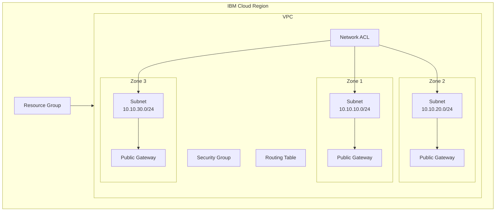

# IBM Cloud VPC with Terraform

[](https://www.terraform.io/)
[](https://cloud.ibm.com/vpc-ext)

A Terraform configuration to deploy a production-ready Virtual Private Cloud (VPC) on IBM Cloud with multi-zone high availability architecture.

## 📑 Table of Contents

- [Architecture Overview](#-architecture-overview)
- [Prerequisites](#-prerequisites)
- [Quick Start](#-quick-start)
- [Configuration](#-configuration)
- [File Structure](#-file-structure)
- [Deployment Steps](#-deployment-steps)
- [Resources Created](#-resources-created)
- [Customization](#-customization)
- [Cleanup](#-cleanup)
- [Troubleshooting](#-troubleshooting)
- [Additional Resources](#-additional-resources)

## 🏗️ Architecture Overview

This Terraform configuration creates a multi-zone VPC infrastructure on IBM Cloud with the following architecture:



### Resources Created

This configuration provisions the following IBM Cloud resources:

| Resource | Description | Quantity |
|----------|-------------|----------|
| **Resource Group** | Logical container for all resources | 1 |
| **VPC** | Virtual Private Cloud network | 1 |
| **Subnets** | Private network segments across availability zones | 3 (one per zone) |
| **Public Gateways** | Enable outbound internet access for subnets | 3 (one per zone) |
| **Network ACL** | Stateless firewall rules for subnet traffic | 1 (default) |
| **Security Group** | Stateful firewall rules for instance traffic | 1 (default) |
| **Routing Table** | Controls traffic routing within the VPC | 1 (default) |

### Network Configuration Details

#### Address Space
- **VPC CIDR Range**: 10.10.0.0/16 (65,536 addresses)
- **Zone 1 Subnet**: 10.10.10.0/24 (256 addresses, 16 usable per configuration)
- **Zone 2 Subnet**: 10.10.20.0/24 (256 addresses, 16 usable per configuration)
- **Zone 3 Subnet**: 10.10.30.0/24 (256 addresses, 16 usable per configuration)

#### High Availability Design
- **Multi-Zone Deployment**: Resources distributed across 3 availability zones within the region
- **Fault Isolation**: Each zone operates independently with dedicated subnets and gateways
- **Zone Naming**: Zones follow the pattern `{region}-1`, `{region}-2`, `{region}-3`

#### Network Components

**Public Gateways**
- Provide SNAT (Source Network Address Translation) for outbound internet connectivity
- One gateway per zone for redundancy
- Attached to subnets to enable internet access for resources without public IPs

**Network ACL (Access Control List)**
- Stateless firewall operating at the subnet level
- Default ACL allows all inbound and outbound traffic
- Can be customized to restrict traffic between subnets

**Security Groups**
- Stateful firewall operating at the instance level
- Default security group created with the VPC
- Rules can be added to control instance-level traffic

**Routing Table**
- Default routing table manages traffic within the VPC
- Automatically routes traffic between subnets in different zones
- Public gateway routes added for internet-bound traffic

#### Terraform Modules Used
- **`terraform-ibm-modules/resource-group/ibm`** (v1.2.0): Manages resource group creation
- **`terraform-ibm-modules/vpc/ibm`**: Creates VPC with subnets, gateways, and networking components

## 📋 Prerequisites

Before you begin, ensure you have the following:

### Required Tools
- **Terraform** >= 1.9.0 ([Download](https://www.terraform.io/downloads))
- **IBM Cloud Account** ([Sign up](https://cloud.ibm.com/registration))
- **IBM Cloud API Key** ([Create one](https://cloud.ibm.com/iam/apikeys))

### Optional Tools
- **IBM Cloud CLI** ([Install](https://cloud.ibm.com/docs/cli)) - for manual verification
- **Git** - for cloning this repository

### IBM Cloud Permissions

Your IBM Cloud API key must have the following permissions:
- Create and manage VPC resources
- Create and manage resource groups (if creating a new one)
- Assign tags to resources

## 🚀 Quick Start

### 1. Clone or Download

```bash
# If using git
git clone <repository-url>
cd vpc-tf

# Or download and extract the files
```

### 2. Configure Variables

Create a `terraform.tfvars` file with your configuration:

```hcl
# Required: Your IBM Cloud API Key
ibmcloud_api_key = "your-api-key-here"

# Optional: Customize these values
region         = "eu-es"              # IBM Cloud region
prefix         = "my-vpc"             # Prefix for resource names
resource_group = "my-resource-group"  # Existing resource group name (or null to create new)
resource_tags  = ["terraform", "vpc", "production"]
```

> **⚠️ Security Note**: Never commit `terraform.tfvars` to version control. It's already included in `.gitignore`.

### 3. Deploy

```bash
# Initialize Terraform and download providers
terraform init

# Preview the changes
terraform plan

# Apply the configuration
terraform apply
```

Type `yes` when prompted to confirm the deployment.

**Estimated deployment time**: 3-5 minutes

## ⚙️ Configuration

### Variables

All configurable variables are defined in `variables.tf`:

| Variable | Type | Required | Default | Description |
|----------|------|----------|---------|-------------|
| `ibmcloud_api_key` | string | ✅ Yes | - | IBM Cloud API key for authentication |
| `region` | string | No | `"eu-es"` | IBM Cloud region (e.g., `us-south`, `eu-de`, `jp-tok`) |
| `prefix` | string | No | `"vpc-fro"` | Prefix added to all resource names |
| `resource_group` | string | No | `"fro_rg"` | Existing resource group name, or `null` to create new |
| `resource_tags` | list(string) | No | `["tf"]` | Tags applied to all created resources |

### Available Regions

IBM Cloud VPC is available in the following regions:

- `us-south` - Dallas, USA
- `us-east` - Washington DC, USA
- `eu-gb` - London, UK
- `eu-de` - Frankfurt, Germany
- `eu-es` - Madrid, Spain
- `jp-tok` - Tokyo, Japan
- `jp-osa` - Osaka, Japan
- `au-syd` - Sydney, Australia
- `ca-tor` - Toronto, Canada
- `br-sao` - São Paulo, Brazil

### Example Configurations

#### Minimal Configuration (Use Defaults)

```hcl
ibmcloud_api_key = "your-api-key-here"
```

#### Custom Region and Naming

```hcl
ibmcloud_api_key = "your-api-key-here"
region           = "us-south"
prefix           = "prod-vpc"
resource_tags    = ["production", "terraform", "networking"]
```

#### Create New Resource Group

```hcl
ibmcloud_api_key = "your-api-key-here"
resource_group   = null  # This will create a new resource group
prefix           = "dev-vpc"
```

## 📁 File Structure

```
vpc-tf/
├── versions.tf      # Terraform and provider version constraints
├── provider.tf      # IBM Cloud provider configuration
├── variables.tf     # Input variable definitions
├── main.tf          # Main resource definitions (VPC, subnets, etc.)
├── terraform.tfvars # Your configuration values (create this)
└── .gitignore       # Excludes sensitive files from git
```

### File Descriptions

- **`versions.tf`**: Defines required Terraform version (>= 1.9.0) and provider versions (IBM Cloud, TLS)
- **`provider.tf`**: Configures the IBM Cloud provider with API key and region
- **`variables.tf`**: Declares all input variables with types, descriptions, and defaults
- **`main.tf`**: Contains the resource definitions using IBM Cloud Terraform modules
- **`terraform.tfvars`**: Your custom values (you create this file)

## 📦 Deployment Steps

### Step 1: Initialize Terraform

```bash
terraform init
```

This command:
- Downloads the IBM Cloud provider plugin
- Downloads the TLS provider plugin
- Initializes the backend
- Downloads required modules

**Expected output:**
```
Initializing modules...
Initializing the backend...
Initializing provider plugins...
- Finding ibm-cloud/ibm versions matching "1.64.0"...
- Finding hashicorp/tls versions matching ">= 4.0.4"...

Terraform has been successfully initialized!
```

### Step 2: Review the Plan

```bash
terraform plan
```

This command:
- Validates your configuration
- Shows what resources will be created
- Estimates the changes without applying them

**Review the output carefully** to ensure it matches your expectations.

### Step 3: Apply the Configuration

```bash
terraform apply
```

This command:
- Shows the execution plan again
- Prompts for confirmation
- Creates all resources in IBM Cloud

Type `yes` to proceed.

**Expected output:**
```
Apply complete! Resources: 10 added, 0 changed, 0 destroyed.
```

### Step 4: Verify Deployment

#### Using Terraform

```bash
# Show all created resources
terraform show

# List resource states
terraform state list
```

#### Using IBM Cloud Console

1. Log in to [IBM Cloud Console](https://cloud.ibm.com)
2. Navigate to **VPC Infrastructure** > **VPCs**
3. Find your VPC (named `{prefix}-vpc`)
4. Verify subnets, gateways, and other resources

#### Using IBM Cloud CLI

```bash
# List VPCs
ibmcloud is vpcs

# List subnets
ibmcloud is subnets

# List public gateways
ibmcloud is public-gateways
```

## 🎯 Resources Created

After successful deployment, the following resources will be created in your IBM Cloud account:

### Resource Group
- **Name**: `{prefix}-resource-group` (if creating new) or your specified existing group
- **Purpose**: Logical container for organizing all VPC resources

### VPC
- **Name**: `{prefix}-vpc`
- **Address Prefixes**: 3 (one per zone)
- **Default Network ACL**: `{prefix}-nacl`
- **Default Security Group**: `{prefix}-sg`
- **Default Routing Table**: `{prefix}-routing-table`

### Subnets (3 total)
- **Zone 1**: `{prefix}-subnet-{region}-1` (10.10.10.0/24)
- **Zone 2**: `{prefix}-subnet-{region}-2` (10.10.20.0/24)
- **Zone 3**: `{prefix}-subnet-{region}-3` (10.10.30.0/24)
- **IP Addresses per Subnet**: 16 usable addresses

### Public Gateways (3 total)
- **Zone 1**: `{prefix}-pw-{region}-1`
- **Zone 2**: `{prefix}-pw-{region}-2`
- **Zone 3**: `{prefix}-pw-{region}-3`
- **Purpose**: Enable outbound internet connectivity for subnet resources

### Network Security
- **Network ACL**: Default rules allowing all traffic (customizable)
- **Security Group**: Default rules for instance-level security (customizable)

## 🔧 Customization

### Changing the Number of Zones

Edit `main.tf` to modify the `locations` parameter:

```hcl
module "vpc" {
  # ... other configuration ...
  
  # Use 2 zones instead of 3
  locations = ["${var.region}-1", "${var.region}-2"]
  
  # Update address_prefixes accordingly
  address_prefixes = [
    {
      name     = "${var.prefix}-${var.region}-1"
      location = "${var.region}-1"
      ip_range = "10.10.10.0/24"
    },
    {
      name     = "${var.prefix}-${var.region}-2"
      location = "${var.region}-2"
      ip_range = "10.10.20.0/24"
    }
  ]
}
```

### Modifying CIDR Blocks

Change the `ip_range` values in the `address_prefixes` section:

```hcl
address_prefixes = [
  {
    name     = "${var.prefix}-${var.region}-1"
    location = "${var.region}-1"
    ip_range = "10.20.10.0/24"  # Changed from 10.10.10.0/24
  },
  # ... other zones ...
]
```

### Adjusting Subnet Size

Modify the `number_of_addresses` parameter:

```hcl
module "vpc" {
  # ... other configuration ...
  
  number_of_addresses = 32  # Changed from 16 (must be power of 2: 8, 16, 32, 64, etc.)
}
```

### Disabling Public Gateways

Set `create_gateway` to `false`:

```hcl
module "vpc" {
  # ... other configuration ...
  
  create_gateway = false  # No public gateways will be created
}
```

### Adding Custom Tags

Update the `resource_tags` variable in `terraform.tfvars`:

```hcl
resource_tags = ["terraform", "production", "networking", "team-platform"]
```

## 🧹 Cleanup

To remove all created resources and avoid ongoing charges:

### Destroy All Resources

```bash
terraform destroy
```

Type `yes` when prompted to confirm deletion.

**⚠️ Warning**: This action is irreversible and will delete:
- All VPC resources (subnets, gateways, etc.)
- The VPC itself
- The resource group (if created by Terraform)

### Verify Deletion

```bash
# Check Terraform state
terraform show

# Or use IBM Cloud CLI
ibmcloud is vpcs
```

### Selective Deletion

To remove specific resources, use targeted destroy:

```bash
# Remove only public gateways
terraform destroy -target=module.vpc.ibm_is_public_gateway

# Remove specific subnet
terraform destroy -target=module.vpc.ibm_is_subnet.subnet[0]
```

## 🔍 Troubleshooting

### Common Issues and Solutions

#### Authentication Errors

**Error**: `Error: The provided API key is invalid`

**Solution**:
1. Verify your API key is correct in `terraform.tfvars`
2. Ensure the API key hasn't expired
3. Check that the API key has sufficient permissions
4. Create a new API key: https://cloud.ibm.com/iam/apikeys

#### Region Not Available

**Error**: `Error: Region 'xx-xxxx' is not valid`

**Solution**:
- Use a valid IBM Cloud region (see [Available Regions](#available-regions))
- Check region availability: https://cloud.ibm.com/docs/overview?topic=overview-locations

#### Resource Quota Exceeded

**Error**: `Error: Quota exceeded for resource type 'vpc'`

**Solution**:
1. Check your account quotas in IBM Cloud Console
2. Delete unused VPCs or request quota increase
3. Contact IBM Cloud support for quota adjustments

#### Module Download Failures

**Error**: `Error downloading modules`

**Solution**:
```bash
# Clear module cache and re-initialize
rm -rf .terraform
terraform init
```

#### State Lock Issues

**Error**: `Error: Error acquiring the state lock`

**Solution**:
```bash
# Force unlock (use with caution)
terraform force-unlock <lock-id>
```

#### CIDR Overlap Errors

**Error**: `Error: Address prefix overlaps with existing prefix`

**Solution**:
- Ensure your CIDR blocks don't overlap with existing VPCs
- Use different IP ranges (e.g., 10.20.x.x instead of 10.10.x.x)

### Getting Help

If you encounter issues not covered here:

1. **Check Terraform logs**: Run with `TF_LOG=DEBUG terraform apply`
2. **IBM Cloud Status**: https://cloud.ibm.com/status
3. **IBM Cloud Support**: https://cloud.ibm.com/unifiedsupport/supportcenter
4. **Terraform IBM Provider Issues**: https://github.com/IBM-Cloud/terraform-provider-ibm/issues

## 📚 Additional Resources

### Documentation
- [IBM Cloud VPC Documentation](https://cloud.ibm.com/docs/vpc)
- [Terraform IBM Provider](https://registry.terraform.io/providers/IBM-Cloud/ibm/latest/docs)
- [IBM Cloud VPC Module](https://registry.terraform.io/modules/terraform-ibm-modules/vpc/ibm/latest)
- [IBM Cloud Resource Group Module](https://registry.terraform.io/modules/terraform-ibm-modules/resource-group/ibm/latest)

### Tutorials
- [Getting Started with VPC](https://cloud.ibm.com/docs/vpc?topic=vpc-getting-started)
- [VPC Networking Concepts](https://cloud.ibm.com/docs/vpc?topic=vpc-about-networking-for-vpc)
- [Terraform on IBM Cloud](https://cloud.ibm.com/docs/ibm-cloud-provider-for-terraform)

### Best Practices
- [VPC Security Best Practices](https://cloud.ibm.com/docs/vpc?topic=vpc-security-in-your-vpc)
- [High Availability Architecture](https://cloud.ibm.com/docs/vpc?topic=vpc-ha-dr-vpc)
- [Terraform Best Practices](https://www.terraform.io/docs/cloud/guides/recommended-practices/index.html)

### Community
- [IBM Cloud Community](https://community.ibm.com/community/user/cloud/home)
- [Terraform Community](https://discuss.hashicorp.com/c/terraform-core)

---

**Note**: This configuration uses IBM Cloud Terraform modules which are actively maintained by IBM. Always check for the latest module versions and update accordingly.
